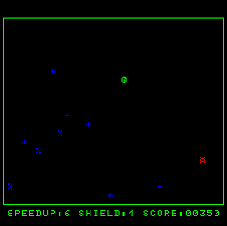
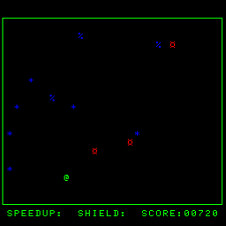

# Игра на Си для БК-0010-01 с использованием сборки gcc-pdp11

Проект представляет собой простую игру для компьютера БК-0010, написанную
на Си с ассемблерными вставками и собираемую в бинарный файл
с помощью компилятора gcc для pdp-11.

 

## Руководство по сборке

В каталоге `src` находится проект в виде файла исходного кода и скрипт сборки:

* build.bat - сборка по шагам без использования Make
* bkgccgame.c - код игры

Сторонние файлы, необходимые для сборки, взяты из проекта [Digger](https://github.com/prcoder-1/digger-bk0010)

* a.out.ld - файл настроек для линкера
* crt0.s - модуль с функцией start, в нем убрана установка скролла и запись в прерывание 4 адреса start
* memory.s - функция memset для компилятор Си
* stdint.h - описатель типов данных для БК-0010

Для сборки также нужен файл `aout2bin.exe`, который можно получить из исходника
`aout2bin.c` в проекте Diggger
